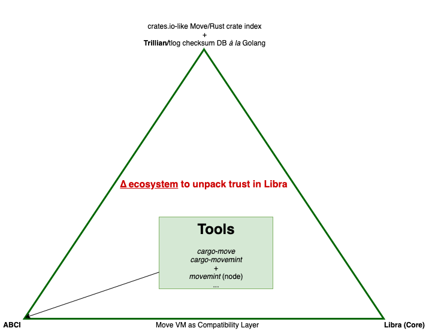

# movemint
Move VM on Tendermint

Table of contents:
- [Overview](#Overview)
- [Dependencies and TCB](#Dependencies-and-TCB)
- [Repo Structure](#Repo-Structure)
- [Running the Placeholder App](#Running-the-Placeholder-App)
- [Join the Movemint!](#Join-the-Movemint)
- [Contributing](#Contributing)
- [Research](#Research)
    - [Our Strategy](#Our-Strategy)
    - [From Golang to Rust and Move](#From-Golang-to-Rust-and-Move)
    - [Protobuf + gRPC](#Protobuf-+-gRPC)

# Overview

This is the genesis repo for `movemint` which is being built by replacing the [SMR] Module of [Libra Core] with [Tendermint]. We'll use *LC* to refer to Libra Core henceforth.

Movemint talks to Tendermint via the [ABCI].

Movemint will primarily depend on the Move language [crate] from LC. A hat-tip to the LC authors and the [Libra Association]!

When complete, Movemint may serve as node software for 1 or more Tendermint-powered networks. Some of these networks may join the [Cosmos] network.

Movemint is a project of the [OL] collective. OL is grateful for grant funding from the [ICF].

See the [Roadmap] to learn more about where we're headed.

# Dependencies and TCB

The current design of Movemint makes use of [rust-abci] for ABCI, [Abscissa] for CLI (and component management), as well as the [Tokio] runtime. (Tokio along with an Actor model is used in LC's `mempool` and `consensus` components.)

As it stands, [Move] is not available as a crate so we have opted to include LC as a git submodule. This should change once the Libra Core components are published on a registry (like crates.io). See the [GitStrategy] doc for more info on our upstream/downstream strategy.

We are focused on minimal dependencies (read [TCB]). Read more on the TCB philosophy from the Libra Assosciation blog: [The Path Forward]. One way of looking at movemint is as an LC-compatible implementation with a different (read smaller) TCB.

We'll have more to say on the notion of TCB as it pertains to Movemint vs. LC.

# Repo Structure

```
├── cargo-move
├── cargo-movemint
├── docs
├── protofiles
└── src
    ├── libra-core     # git submodule
    └── main.rs
```

# Running the Placeholder App

Make sure you have installed [Git], [Rust]/[Cargo], and [Tendermint].

Clone this repo:

`git clone https://github.com/open-libra/movemint`

Update the Libra Core submodule. `cd` into the cloned repo and run: `git submodule update --init --recursive`

Then build movemint: `cargo build`

To run it, open two windows:

on the 1st, run: `cargo run movemint`

on the 2nd, run: `tendermint init` and then `tendermint node`

You will see that the dummy `movemint` app connects to Tendermint via ABCI. There is an *unused* MoveVM instance that is to be used to validate, verify, and execute transactions (TODO!).

In the coming weeks we will be fleshing out this repository with code and documentation. See the [Components] doc to learn more about tools we are building.

# Join the Movemint

Now, you may want to join us as we work hard to make `movemint` a reality! Jump to the `Research` section; it may give you ideas to contribute as code or documentation! You may also want to join the [OL] collective's [Discord] channel.

# Contributing

Use standard GitHub practices. Fork this repository. Clone to your machine. Branch from the tip, etc.

`git branch -b my_awesome_contribution_to_the_movemint`

Code away, commit, test, and push to GitHub.

Finally, when you're ready to merge, please submit a PR. We will promptly review the code and (if all goes well) we'll merge it to master!

# Research

For the past few months we've been busy doing research on the Libra ecosystem: papers, codebase, community, et cetera.

## Our Strategy

We have come up with a **∆ strategy** wherein the `Move VM` serves as `compatiblity layer` between a Movemint network and an LC network.

We will publish a blog about this ∆-ular strategy of 'unpacking trust in Libra'.

Note that [TCB] is a term used in the trusted computing domain.



## From Golang to Rust and Move

The Tendermint/Cosmos ecosystem is increasingly adopting Rust. The [rust-abci] and [tendermint-rs] crates are good examples. There are also tools like `kms` and `sagan` built for Tendermint in Rust. We hope to contribute to the Cosmos Rust SDK in the process of building Movemint (e.g. a Rust equivalent of the Cosmos Go SDK's [BaseApp]).

The Golang team has recently introduced the [Go checksum] database (built on [Trillian]):

    Being able to authenticate a particular module version download effectively moves code hosting servers like rsc.io and github.com out of the trusted computing base [TCB] of the Go module ecosystem.

Introducing a similar checksum DB to Rust (e.g. in crates.io) and to `Move` itself is within our [Roadmap]. This is beneficial to the Rust community at large as well as the nascent Move language ecosystem. More importantly, it allows Move-compatible financial networks to share Move packages in a trustworthy fashion. We'll explain our rationale and design goals in the [tlog-rust-move] doc.

`Cargo` is a powerful tool into which we can introduce checksum database checking and more. To this end, we're building a `movemint`-specific plugin and a general purpose plugin to work with Move code from within Cargo. These are found in `./cargo-movemint` and `./cargo-move` directories, respectively. Both plugins are to be built with the [Abscissa] framework (h/t [@bascule](https://twitter.com/bascule)).

## Protobuf + gRPC

Last but not least, the `protofiles` directory is a repository of protobuf files extracted from LC, Tendermint/ABCI, and [Trillian] for convenience. Note that the last 2 are implemented in Golang whereas LC is written in Rust. We encourage researchers and developers planning to work on Movemint to familiarize themselves with the protobuf/[gRPC] files in the `abci` and `lc` directories first. (The `trillian` directory will come in handy too, in the near future!)

The 3 directories roughly correspond to 3 points in a triangle, hence the `∆` in our strategy.

-----

DISCLAIMER

_THERE MAY BE DRAGONS._

All content in this repo including the README are licensed under Apache-2.0.

-----

[crate]: https://developers.libra.org/docs/crates/vm
[crates.io]: https://crates.io
[Libra Core]: https://github.com/libra/libra
[The Path Forward]: https://developers.libra.org/blog/2019/06/18/the-path-forward
[Libra Assosciation]: https://libra.org

[OL]: https://openlibra.io
[Discord]: https://discord.gg/wXHHxD

[SMR]: https://en.wikipedia.org/wiki/State_machine_replication
[Move]: https://developers.libra.org/docs/move-paper

[Tendermint]: https://tendermint.com
[tendermint-rs]: https://crates.io/crates/tendermint
[ABCI]: https://tendermint.com/docs/spec/abci/
[rust-abci]: https://crates.io/crates/abci
[Cosmos]: https://cosmos.network
[BaseApp]: https://github.com/cosmos/cosmos-sdk/tree/master/baseapp
[ICF]: https://interchain.io

[TCB]: https://en.wikipedia.org/wiki/Trusted_computing_base

[Abscissa]: https://iqlusion.blog/introducing-abscissa-rust-application-framework
[Tokio]: https://tokio.rs/
[gRPC]: https://grpc.io

[Trillian]: https://github.com/google/trillian
[Go checksum]: https://go.googlesource.com/proposal/+/master/design/25530-sumdb.md
[Trillian Rust API]: https://twitter.com/BenLaurie/status/1167335026507337730

[tlog-rust-move]: docs/tlog-rust-move.md
[Components]: docs/Components.md
[GitStrategy]: docs/GitStrategy.md
[Roadmap]: docs/Roadmap.md

[Git]: https://git-scm.com/book/en/v2/Getting-Started-Installing-Git
[Rust]: https://rust-lang.org
[Cargo]: https://doc.rust-lang.org/cargo/getting-started/installation.html
